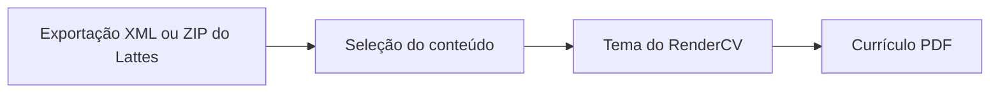

# cv-lattex

Transforme seu Currículo Lattes em um PDF com temas e seleção de conteúdo.

O projeto está em desenvolvimento. A CLI e a instalação do pacote ainda não
estão disponíveis.

A proposta é gerar versões diferentes do mesmo currículo: uma seleção de
publicações, uma apresentação profissional ou um currículo acadêmico completo.
O conteúdo poderá ser escolhido por seção, registro e nível de detalhe.

A renderização usará [RenderCV](https://docs.rendercv.com/) e Typst, com saída
editável em YAML e Typst, além do PDF.

## Formato Lattes

O [CNPq publica um XSD](https://memoria.cnpq.br/web/portal-lattes/extracoes-de-dados)
com a estrutura do XML. Exportações podem conter campos adicionais e categorias
que não aparecem em todos os currículos. Os
[exemplos sintéticos](tests/fixtures/README.md) documentam casos de referência
para o desenvolvimento; sua presença não significa que a conversão já está
implementada.

## Contribuições e licença

Consulte [CONTRIBUTING.md](CONTRIBUTING.md) para preparar o ambiente e contribuir.
Distribuído sob a [licença MIT](LICENSE).
